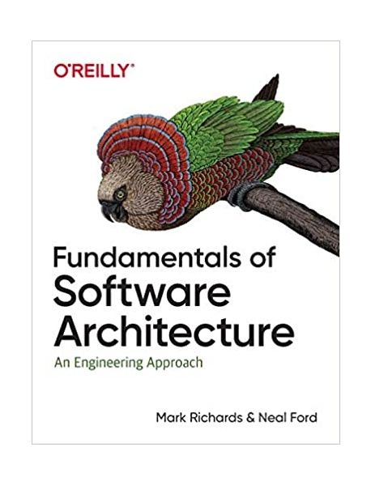

# Software Architecture 101 Study

  

[명언 모음집](./quotes.md)

## 🚧 규칙

1. 매주 두 챕터를 [SQ3R 방식](https://m.blog.naver.com/PostView.naver?isHttpsRedirect=true&blogId=lmajo2000&logNo=140201059426)으로 읽는다.
2. 매주 일요일 오후 4시에 디스코드에서 만나 학습 내용을 공유한다.
3. 이전 주차 내용에 대해 작성했던 질문들에 대한 답변을 작성하여 공유한다. (3R)
4. 다음 주차에 읽을 내용에 대해 미리 훑어보고 질문을 작성하여 공유한다. (SQ)

## 📝 학습자료

- 원서: [Fundamentals of Software Architecture](https://product.kyobobook.co.kr/detail/S000028954419)
- 번역서: [소프트웨어 아키텍처 101](https://ridibooks.com/books/443000966)

## 🖐 참여자

| 참가자 이름 |                 Github 프로필                 |            정리 자료            |
| :---------: | :-------------------------------------------: | :-----------------------------: |
|   김우리    |   [woori3104](https://github.com/woori3104)   |  [:link:](woori3104/README.md)  |
|   정진우    | [bugoverdose](https://github.com/bugoverdose) | [:link:](bugoverdose/README.md) |
|    친슈     |   [Achelous1](https://github.com/Achelous1)   |  [:link:](Achelous1/README.md)  |

Written by <a href="https://github.com/bugoverdose">@Jeong Jinwoo</a><small>🔨</small>

